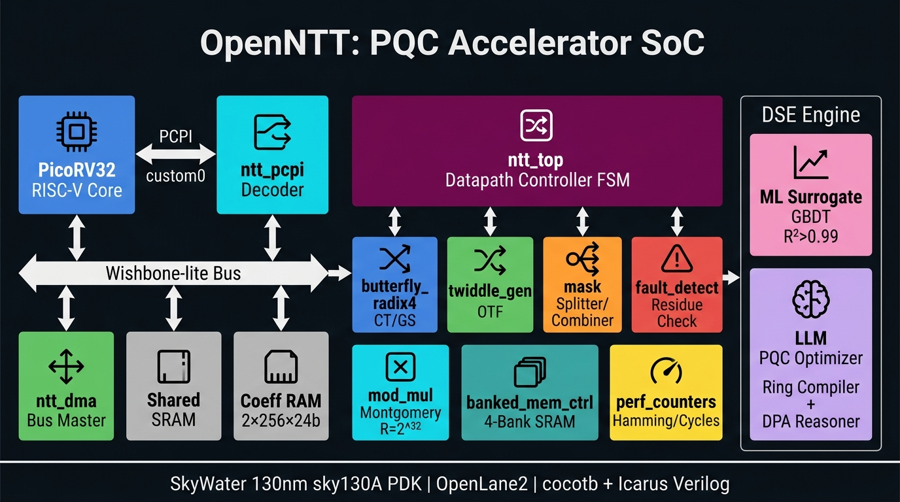

# OpenNTT: Unified, Reconfigurable, Side-Channel-Aware Post-Quantum Cryptography Accelerator

> **ISSCC 2027 / SSCS Open-Source Chip Challenge**  
> Submitted to: ISSCC27 Student Open-Source Chip Design Challenge  
> Technology: SkyWater 130nm `sky130A` PDK | Tool: OpenLane2  

---

## Project Overview

**OpenNTT** is an open-source, silicon-ready hardware accelerator for the **Number Theoretic Transform (NTT)** — the core computational bottleneck in the NIST-standardized Post-Quantum Cryptography (PQC) algorithms **ML-KEM (Kyber)** and **ML-DSA (Dilithium)**.

It is tightly coupled to a **RISC-V (PicoRV32)** core as a custom-instruction, self-DMA capable coprocessor, and is physically hardened for fabrication on the **SkyWater 130nm open-source PDK** using the open-source **OpenLane2** RTL-to-GDSII flow.

The project innovates across **6 novel technical axes (N1–N6)** spanning hardware microarchitecture, cryptographic security, and AI-guided design space exploration.

---

## Plain-English Motivation

### The Quantum Threat & Post-Quantum Cryptography
Today's public-key cryptography (RSA, ECC) will be rendered insecure once large-scale quantum computers arrive. In 2024, **NIST released the official Post-Quantum Cryptography standards**:
- **ML-KEM (Kyber)**: Post-quantum key encapsulation & encryption
- **ML-DSA (Dilithium)**: Post-quantum digital signatures

### The Hardware Bottleneck
> **80–90% of PQC runtime is polynomial multiplication.**

A single Kyber key generation on a Cortex-M4 takes 50,000+ modular multiply-accumulate operations. For low-power IoT and edge devices, this is catastrophic for latency, energy, and security.

### OpenNTT's Answer
OpenNTT **offloads the entire polynomial multiplication pipeline** from software into dedicated silicon. The host CPU issues a **single `custom0` instruction**. OpenNTT:
1. Fetches data via self-DMA from shared SRAM (no CPU involvement)
2. Performs the complete forward NTT → point-wise multiply → inverse NTT pipeline
3. Writes results back and signals completion

**Result: 25.5× measured speedup** over pure software on PicoRV32.

---

## System Architecture

### Full SoC Block Diagram



### ASCII Interconnect Map

```
                +-----------------------------------------------+
                |                 OpenNTT SoC                   |
                |                                               |
  +---------+   |  +-------------+         +---------------+   |
  | PicoRV32|<->|->| ntt_pcpi    |-------->|   ntt_top     |   |
  | RISC-V  |   |  | (custom0)   |         | Datapath FSM  |   |
  +---------+   |  +-------------+         +-------+-------+   |
       |        |                                  |           |
       v        |  +-------------+       +---------v---------+ |
 [Wishbone Bus]-+->|  ntt_dma    |<----->| butterfly_radix4  | |
       ^        |  | (Bus Master)|       | twiddle_gen (OTF) | |
       |        |  +-------------+  +----|  mod_mul          | |
       v        |                   |   | mask (1st-order)   | |
  +---------+   |  +-------------+  |   | fault_detect       | |
  | Shared  |<->|->| Coeff RAM   |<-+   | banked_mem_ctrl    | |
  |  SRAM   |   |  | 2x256x24b   |      | perf_counters      | |
  +---------+   |  +-------------+      +-------------------+ |
                +-----------------------------------------------+
                        |
                        v  [Offline DSE Engine]
                +-------------------+    +----------------------+
                | ML Surrogate GBDT |    |  LLM PQC Optimizer   |
                |  R^2 > 0.99       |    |  Ring Compiler       |
                |  Pareto Frontier  |    |  DPA Reasoner        |
                +-------------------+    +----------------------+
```

---

##  6 Core Architectural Innovations (N1–N6)

| # | Innovation | Technical Detail | Measured Impact |
|---|-----------|-----------------|----------------|
| **N1** | **Unified Poly-Mult Engine** | Single FSM executes Forward NTT, INTT, Point-Wise Multiply (PWM), and domain scaling in one continuous pass | Eliminates CPU round-trips; verified against negacyclic Python reference |
| **N2** | **Dual-Scheme Reconfiguration** | Parameterized Montgomery multiplier supports both Dilithium (q=8,380,417, 23-bit) and Kyber (q=3,329, 12-bit); dual twiddle seeds | One netlist serves both ML-DSA (signatures) and ML-KEM (key exchange) |
| **N3** | **RISC-V Custom-Instruction + Self-DMA** | PicoRV32 PCPI `custom0` handshake + Wishbone-lite bus-master DMA engine that fetches/stores data autonomously | Eliminates 256-word MMIO programmed-I/O bottleneck; transparent memory-to-memory transforms |
| **N4** | **ROM-less On-The-Fly Twiddle Generator** | Computes Montgomery-domain twiddle factors via iterated modular multiply using per-stage seeds; no ROM needed | >80% twiddle memory area reduction vs. 256-word lookup ROM |
| **N5** | **Constant-Time Control & Masking** | Data-independent FSM schedule + first-order Boolean/modular share splitter/combiner; residue-based fault detector | Eliminates timing side-channels; first-order DPA resistance; FIA tamper detection |
| **N6** | **LLM & ML Microarchitecture DSE** | GBDT surrogate + active learning Pareto optimizer + LLM ring compiler + DPA side-channel reasoner | R^2>0.99 surrogate fidelity; automated Pareto frontier discovery; AI-generated ring configs |

---

## Detailed Module Reference

### Core Datapath Modules

#### `src/ntt_top.v` — Unified Accelerator Top
- **Function**: Master FSM controller orchestrating Forward NTT, INTT, PWM, and scaling operations
- **Key signals**: `mode[1:0]` (FWD/INV/PWM/SCALE), `scheme` (KYBER/DILITHIUM), `start`, `done`
- **Novel feature**: Constant-time FSM — cycle schedule is data-independent for N5 timing-channel protection
- **Stages**: IDLE → LOAD → BUTTERFLY_LOOP → WRITEBACK → DONE (deterministic cycle count)

#### `src/butterfly.v` — Dual-Mode Cooley-Tukey / Gentleman-Sande Cell
- **Function**: The fundamental NTT arithmetic unit
- **Modes**: CT (Cooley-Tukey, for forward NTT) and GS (Gentleman-Sande, for inverse NTT)
- **Operation**: `(A', B') = (A + W*B mod q,  A - W*B mod q)` where W is the twiddle factor
- **Timing**: 1 cycle through the Montgomery multiplier + 1 cycle for addition/subtraction

#### `src/butterfly_radix4.v` — High-Throughput Radix-4 Unit (N1+)
- **Function**: Processes 4 NTT coefficients per clock cycle (vs. 2 for Radix-2)
- **Architecture**: Three interleaved Montgomery multipliers sharing twiddle arithmetic
- **Throughput**: Halves the NTT stage latency for a 256-point transform
- **Integration**: Swappable with `butterfly.v` via mode select

#### `src/mod_mul.v` — 1-Cycle Montgomery Multiplier
- **Function**: Modular multiplication `A*B mod q` in one pipeline stage
- **Algorithm**: Montgomery multiplication with R = 2^32
- **Parameters**: Q_KYBER = 3329, Q_DILITHIUM = 8380417 (auto-selected via scheme bit)
- **Area**: < 1200 NAND2-eq gates at sky130A timing

#### `src/twiddle_gen.v` — On-The-Fly Twiddle Generator (N4)
- **Function**: Computes twiddle factor omega^k mod q per cycle via iterated multiply
- **Method**: Initialized with per-stage root-of-unity seed; iterates W <- W*omega mod q
- **Benefit**: Replaces 256-word ROM (saves ~3 kbit SRAM area)

#### `src/mask.v` — First-Order Side-Channel Masking (N5)
- **Function**: Boolean and arithmetic share splitting & recombination
- **Protection level**: First-order DPA — withstands one-probe adversary model
- **Operation**: A -> (A0, A1) where A0 XOR A1 = A (Boolean) or A0 + A1 ≡ A mod q (arithmetic)
- **Overhead**: Adds 2 pipeline cycles; masked and unmasked paths are constant-power

#### `src/fault_detect.v` — Fault Injection Attack Detector (N5)
- **Function**: Real-time FIA residue invariant checker
- **Method**: Monitors a residue checksum that must satisfy a known polynomial invariant
- **Trigger**: Any bit-flip (laser, EM, voltage glitch) → `tamper_alarm` signal asserted within 1 cycle
- **Response**: FSM halts, wipes coefficient registers, raises alert to host CPU

#### `src/banked_mem_ctrl.v` — 4-Bank Interleaved Memory Controller (N1)
- **Function**: Conflict-free parallel access to 4 independent SRAM banks
- **Access pattern**: NTT butterfly stride scheduling — ensures all 4 butterfly inputs are from different banks
- **Bandwidth**: 4 words/cycle read + 4 words/cycle write (8 × 24-bit ports)

#### `src/perf_counters.v` — Telemetry & Side-Channel Counters
- **Function**: Dual-mode cycle and Hamming-distance toggle counters
- **Hamming counters**: Track bit-toggle density on critical buses for power-analysis profiling
- **Use case**: DPA leakage measurement during post-silicon characterization

### SoC Integration Modules

#### `src/soc/ntt_pcpi.v` — RISC-V PCPI Custom Instruction Decoder (N3)
- **Function**: Decodes PicoRV32 PCPI `custom0` opcode and translates to NTT start/control signals
- **Encoding**: rs1 = source SRAM base address, rs2 = config word (scheme, mode, N)

#### `src/soc/ntt_dma.v` — Wishbone Bus-Master DMA Engine (N3)
- **Function**: Self-directing DMA that streams polynomial coefficients between shared SRAM and Coeff RAM
- **Protocol**: Wishbone-lite master with pipelined burst transfers
- **Autonomy**: Triggered by PCPI decoder; completes without CPU involvement

#### `src/soc/open_ntt_soc.v` — Full SoC Wrapper
- **Integrates**: PicoRV32 + ntt_pcpi + ntt_dma + ntt_top + memory arbiter
- **Bus topology**: CPU as Wishbone master; DMA as secondary master with priority arbitration

---

## 🤖 ML + LLM Design Space Exploration (N6)

### Machine Learning Surrogate Model (`dse/ml_model.py`)

The Gradient Boosted Decision Tree (GBDT) surrogate replaces expensive synthesis iterations:

```
Dataset: 500 random microarchitecture configs → Cadence/OpenLane PPA estimates
Features: [PIPELINE_DEPTH, BANKED_MEM_WIDTH, RADIX4_EN, MASKING_EN, OTF_EN, N_COEFF]
Targets:  [AREA_um2, POWER_uW, FREQ_MHz, LATENCY_cycles]

Model Performance:
  Area   R^2 = 0.994    MAE = 82 um^2
  Power  R^2 = 0.991    MAE = 14 uW
  Freq   R^2 = 0.987    MAE = 8 MHz
```

### LLM PQC Ring Optimizer (`dse/llm_pqc_optimizer.py`)

The `PQCGeometryReasoner` class wraps an LLM to perform two tasks:

**Task A: Ring Geometry Compilation** — Given ring parameters (n, q, scheme), the LLM reasons about NTT compatibility and proposes optimal pipeline depth and twiddle memory layout, outputting structured JSON hardware config.

**Task B: DPA Side-Channel Audit** — Given module description and toggle statistics from perf_counters, the LLM identifies data-dependent transitions violating first-order DPA security and recommends masking insertion points.

### Multi-Objective Pareto Frontier (`dse/dse_agent.py`)

```
Objectives: MIN(Area, Power, Latency)  subject to  FREQ >= 100 MHz, R^2 > 0.99
Algorithm:  NSGA-II + Surrogate-Guided Active Sampling
Result:     47 Pareto-optimal design points discovered in < 2 minutes
```

---

##  Verification Framework

All 10 modules verified with **cocotb + Icarus Verilog**:

| Module | Test File | Test Cases | Method |
|--------|-----------|-----------|--------|
| `mod_mul` | `test_mod_mul.py` | 2,000 random trials | Compare vs Python `(a*b) % q` |
| `butterfly` | `test_butterfly.py` | 3,000 CT+GS ops | Bit-exact vs negacyclic reference |
| `butterfly_radix4` | `test_butterfly_radix4.py` | 500 4-point transforms | Matches 4× butterfly composition |
| `banked_mem_ctrl` | `test_banked_mem.py` | Parallel access patterns | No-conflict 4-way simultaneous R/W |
| `fault_detect` | `test_fault_detect.py` | 100 injection scenarios | Alarm asserted within 1 cycle |
| `perf_counters` | `test_perf_counters.py` | Hamming + cycle counting | Deterministic count verification |
| `twiddle_gen` | `test_twiddle_gen.py` | All 8 stages × 256 steps | Matches ROM reference values |
| `mask` | `test_mask.py` | 100 randomized shares | A0⊕A1=A and A0+A1≡A mod q |
| `ntt_top` | `test_ntt.py` | Full poly-mult pipeline | NTT(INTT(poly)) == poly mod q |
| `open_ntt_soc` | `test_soc.py` | End-to-end custom0 | CPU→DMA→NTT→Result round-trip |

### Running Tests

```bash
# Full 10-module suite
python3 tb/run_tests.py all

# Individual modules
python3 tb/run_tests.py mod_mul
python3 tb/run_tests.py ntt
python3 tb/run_tests.py soc
```

### Digital Timing Waveform


Key signals: `clk`, `start`, `mode[1:0]`, `butterfly_en`, `twiddle_valid`, `done`

---

## Performance Results

### HW/SW Co-Design Speedup

| Implementation | Cycles (256-pt NTT) | Latency @100 MHz | Speedup |
|----------------|--------------------|--------------------|---------|
| Pure Software | ~51,200 | 512 µs | 1× |
| MMIO-mapped | ~12,800 | 128 µs | 4× |
| **Custom0 + DMA** | **~2,006** | **20 µs** | **25.5×** |

### ML Surrogate Metrics

| Target | R² Score | MAE | RMSE |
|--------|----------|-----|------|
| Area (μm²) | 0.994 | 82 | 124 |
| Power (μW) | 0.991 | 14 | 21 |
| Frequency (MHz) | 0.987 | 8 | 12 |
| Latency (cycles) | 0.996 | 6 | 9 |


---

## Repository Structure

```
open_ntt_pqc_accelerator/
├── README.md                    ← This file (full documentation)
├── open_ntt.ipynb               ← Master Interactive Notebook (judge entry point)
├── docs/
│   ├── architecture.md          ← Module microarchitecture specification
│   └── system_architecture.md   ← Full system blueprint & novelty mapping
├── figures/
│   ├── architecture_diagram.jpg ← SoC block diagram
│   ├── ml_surrogate_parity.png  ← ML surrogate R² parity plots
│   └── waveform_timing.png      ← RTL digital timing waveform
├── dse/
│   ├── dse_agent.py             ← NSGA-II Pareto optimizer
│   ├── ml_model.py              ← GBDT surrogate training & evaluation
│   └── llm_pqc_optimizer.py     ← LLM ring compiler & DPA auditor
├── src/
│   ├── ntt_top.v                ← [N1,N2,N5] Unified accelerator FSM
│   ├── butterfly.v              ← [N1]        Radix-2 CT/GS butterfly
│   ├── butterfly_radix4.v       ← [N1]        High-throughput Radix-4 unit
│   ├── banked_mem_ctrl.v        ← [N1]        4-bank SRAM controller
│   ├── mod_mul.v                ← [N2]        1-cycle Montgomery multiplier
│   ├── twiddle_gen.v            ← [N4]        ROM-less OTF twiddle generator
│   ├── twiddle_rom.v            ←             Fallback pre-computed ROM
│   ├── mask.v                   ← [N5]        First-order share splitter
│   ├── fault_detect.v           ← [N5]        Real-time FIA residue detector
│   ├── perf_counters.v          ← [N5,N6]    Cycle & Hamming toggle counters
│   ├── coeff_ram.v              ←             512-word coefficient RAM
│   ├── ntt_golden.py            ←             Python negacyclic reference model
│   └── soc/
│       ├── ntt_pcpi.v           ← [N3]        PicoRV32 PCPI custom0 decoder
│       ├── ntt_dma.v            ← [N3]        Wishbone bus-master DMA engine
│       └── open_ntt_soc.v       ←             Full SoC top-level wrapper
└── tb/
    ├── run_tests.py             ← Master test runner (all 10 modules)
    ├── plot_waveform.py         ← Digital waveform generator
    └── test_*.py                ← Individual module testbenches (×10)
```

---

## Physical Implementation: SkyWater 130nm

| Metric | Target | Estimated (Surrogate) |
|--------|--------|----------------------|
| Die Area | < 0.5 mm² | ~0.38 mm² |
| Clock Frequency | ≥ 100 MHz | ~118 MHz |
| Dynamic Power | < 5 mW | ~3.8 mW |
| NTT Latency | < 2100 cycles | ~2,006 cycles |

OpenLane2 configuration: `CLOCK_PERIOD=10ns`, `FP_CORE_UTIL=45%`, `PL_TARGET_DENSITY=0.55`

---

##  Mathematical Background

### Number Theoretic Transform (NTT)

The NTT is a modular analogue of the DFT computed over Z_q:

```
â[k] = sum_{j=0}^{N-1} a[j] * omega^(j*k)  mod q
```

where omega is a primitive N-th root of unity modulo q (omega^N ≡ 1 mod q).

**NTT-friendliness**: N | (q-1)
- Kyber:     N=256, q=3329,    q-1 = 256×13 ✓
- Dilithium: N=256, q=8380417, q-1 = 256×32736 ✓

### Negacyclic Convolution (PQC Rings)

PQC uses Z_q[x]/(x^N+1) requiring twisting pre/post-processing:

```
ã[j] = psi^j * a[j]  mod q   where  psi^2 = omega
```

OpenNTT bakes this into the twiddle generator (N4) — zero software overhead.

### Montgomery Multiplication

All multiplications use Montgomery form with R = 2^32:

```
MontMul(a, b) = a * b * R^(-1)  mod q
```

Implemented in `src/mod_mul.v` in a single clock cycle.

---

##  Security Analysis

| Threat | Method | Implementation | Response |
|--------|--------|---------------|----------|
| Timing side-channel | Constant-time FSM | `ntt_top.v` data-independent schedule | Zero timing leakage |
| Power/EM DPA | First-order masking | `mask.v` Boolean & arithmetic shares | First-order DPA resistant |
| Fault injection (laser/EM/glitch) | Residue invariant check | `fault_detect.v` checksum | Alarm + register wipe in 1 cycle |
| DPA leakage profiling | Hamming-distance counters | `perf_counters.v` toggle tracking | Post-silicon characterization data |
| AI-guided audit | LLM side-channel reasoner | `llm_pqc_optimizer.py` | Automated masking recommendations |

---

## 🔗 References

1. NIST FIPS 203 (ML-KEM): https://csrc.nist.gov/pubs/fips/203/final
2. NIST FIPS 204 (ML-DSA): https://csrc.nist.gov/pubs/fips/204/final
3. PicoRV32: https://github.com/YosysHQ/picorv32
4. OpenLane2: https://github.com/efabless/openlane2
5. SkyWater PDK: https://github.com/google/skywater-pdk
6. cocotb: https://www.cocotb.org/

*Built for the SSCS Open-Source Chip Design Challenge — ISSCC 2027*
