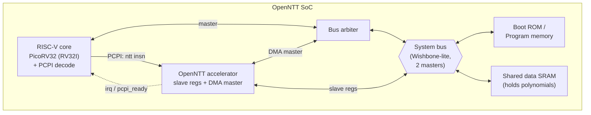
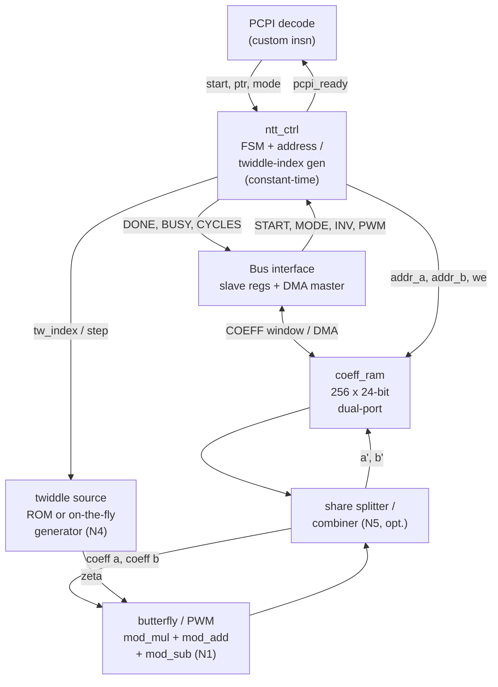
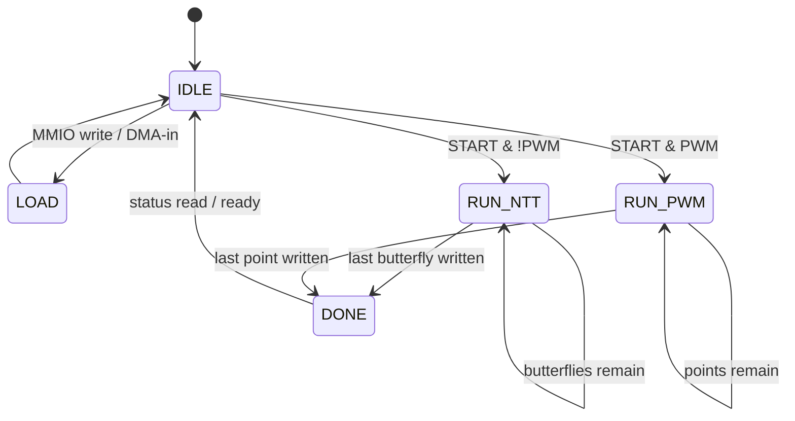
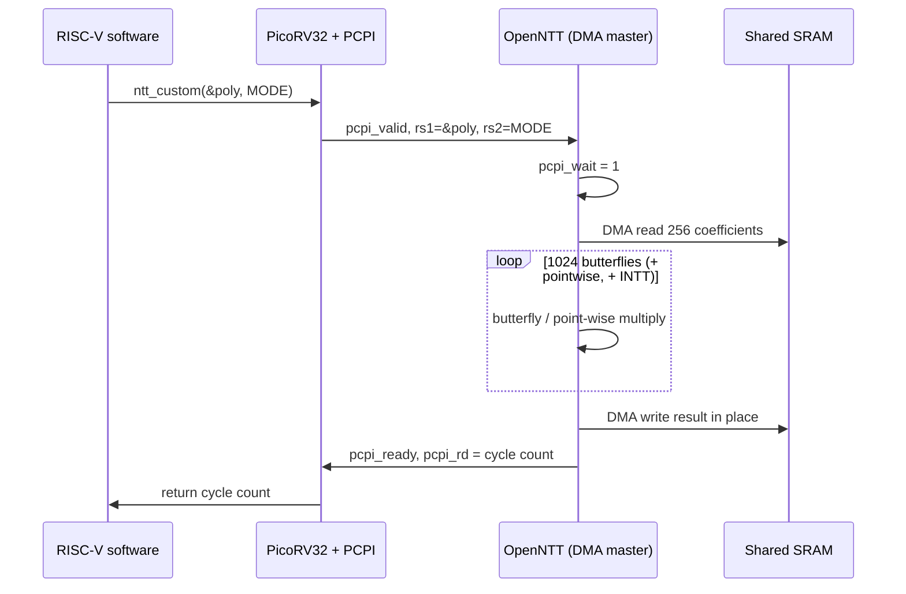
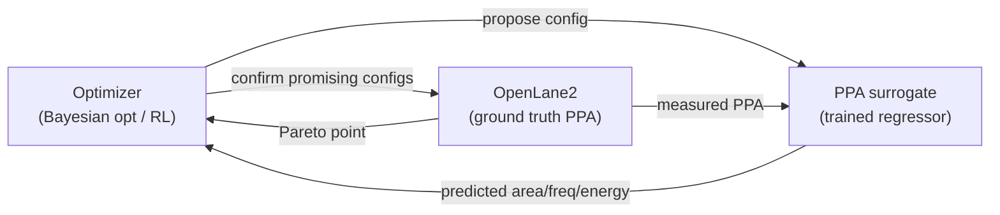

# OpenNTT — System Architecture

OpenNTT is a **unified, reconfigurable, side-channel-aware polynomial-multiplication
accelerator** for the NIST post-quantum lattice standards ML-KEM (Kyber) and
ML-DSA (Dilithium), tightly coupled to a RISC-V core as a custom-instruction,
DMA-capable functional unit, and hardened to a Sky130 GDS entirely with
open-source tools.

This document is the design blueprint: every block, how the blocks connect, how
data flows from software down to the arithmetic datapath, the cycle-level
behavior, and — importantly — **what makes the architecture novel** and how each
novelty is measured. The RTL is a direct transcription of the diagrams here.

Diagrams use [Mermaid](https://mermaid.js.org/) (rendered by GitHub and
JupyterLab), with ASCII versions for the datapath and timing.

---

## 1. Motivation

NIST standardized lattice cryptography in 2024: ML-KEM (Kyber) and ML-DSA
(Dilithium). Both spend most of their runtime multiplying polynomials in the ring
`Z_q[x] / (x^n + 1)`. The Number Theoretic Transform (NTT) turns an `O(n^2)`
polynomial multiply into an `O(n log n)` transform plus a point-wise product. In
software on a RISC-V core, that transform dominates key generation, signing, and
verification.

OpenNTT offloads the **entire polynomial multiplication** — forward NTT,
point-wise product, and inverse NTT — into hardware, so the RISC-V core issues a
single custom instruction instead of executing thousands of modular
multiplications.

---

## 2. What is novel

Most open-source NTT hardware is single-scheme, ROM-based, forward-transform-only,
and attached to the host by programmed I/O. OpenNTT changes five things at the
architecture level. Each is paired with a concrete measurement so the novelty is
demonstrated, not just claimed.

| # | Novel feature | Why it is new | How it is measured |
|---|---------------|---------------|--------------------|
| N1 | **Unified poly-mult engine**: one datapath runs forward NTT, point-wise multiply, and inverse NTT (the complete `c = INTT(NTT(a)∘NTT(b))`). | Most accelerators expose only the forward transform and leave the rest to software. | End-to-end polynomial multiply verified against schoolbook negacyclic reference; cycles for the full operation. |
| N2 | **Dual-scheme, dual-modulus** reconfiguration: the same silicon runs Kyber (q=3329, incomplete NTT) and Dilithium (q=8380417, complete NTT) at runtime. | Open NTT cores usually hard-wire one scheme/modulus. | Both schemes pass known-answer tests on one netlist; area overhead of reconfigurability vs a single-mode build. |
| N3 | **RISC-V custom-instruction + self-DMA** coupling: the CPU issues one `ntt` instruction carrying a memory pointer; the accelerator is a **bus master** and fetches/writes the polynomial itself. | Removes the 256-word programmed-I/O bottleneck of MMIO-only designs; tight ISA coupling instead of a peripheral. | Cycle count of custom-instruction+DMA vs MMIO programmed-I/O for the same transform (co-design result). |
| N4 | **ROM-less on-the-fly twiddle generation**: twiddles are produced by iterated Montgomery multiplication instead of a stored table, selectable at compile time. | Eliminates the twiddle ROM, the largest constant-memory block. | Area/power of ROM-based vs generator-based builds, from OpenLane2 Sky130 reports. |
| N5 | **Constant-time, side-channel-aware datapath**: control flow and cycle count are independent of coefficient values; an optional first-order Boolean masking mode splits each coefficient into two shares. | Side-channel resistance is rarely addressed in student/open NTT hardware, yet it is central to real PQC. | Cycle-count invariance across random inputs; area/energy cost of the masked mode vs unmasked. |
| N6 | **ML-driven design-space exploration**: a Bayesian-optimization / lightweight-RL agent tunes the microarchitecture (mod_mul pipeline depth, radix-2 vs radix-4 butterfly, memory bank count, ROM vs generator) against a learned PPA **surrogate model**, then confirms the Pareto front with full OpenLane2 runs. | The AI optimizes the accelerator's own hardware — not RTL text — and the surrogate cuts the number of expensive OpenLane2 runs; automated PPA optimization mirrors recent Code-a-Chip winners. | Pareto front (area/throughput/energy) found by the agent vs random search; OpenLane2 runs saved by the surrogate. |

Everything is delivered as a **fully open, reproducible RTL-to-GDS flow on
Sky130** (Yosys + OpenLane2), with SPICE characterization of the Montgomery cell
— itself a differentiator, since most PQC-hardware papers use commercial tools
and advanced nodes.

**Novelty tiers (scope control):** N1, N2, N4 and the constant-time property of
N5 are the target deliverables. N3's DMA master and N5's masking mode are
stretch goals; the MMIO path (§4) and the unmasked datapath are the guaranteed
fallbacks so the project always produces a complete, verified, hardened design.

---

## 3. System (SoC) view — how the RISC-V connects

OpenNTT attaches to a PicoRV32 core in **two ways at once**, and the project
compares them:

- **Loose coupling (baseline, N-fallback):** the accelerator is a memory-mapped
  slave. Software copies coefficients in, starts the engine, polls, copies out.
- **Tight coupling (N3, target):** a RISC-V **custom instruction** (`custom0`
  opcode via the PicoRV32 PCPI interface) triggers the transform with a pointer
  argument; the accelerator, acting as a **bus master**, DMAs the polynomial
  from shared SRAM, transforms it in place, and raises `done`.



PCPI custom-instruction handshake (PicoRV32):

| Signal        | Dir (acc) | Meaning                                     |
|---------------|-----------|---------------------------------------------|
| `pcpi_valid`  | in        | CPU offers a custom instruction             |
| `pcpi_insn`   | in        | 32-bit instruction word (opcode `custom0`)  |
| `pcpi_rs1`    | in        | operand 1 = polynomial base pointer         |
| `pcpi_rs2`    | in        | operand 2 = mode/inverse flags              |
| `pcpi_wr`     | out       | 1 = write a result register back            |
| `pcpi_rd`     | out       | result value (e.g. cycle count / status)    |
| `pcpi_wait`   | out       | held high while the transform runs          |
| `pcpi_ready`  | out       | asserted for one cycle when complete        |

Slave/DMA bus signals (Wishbone-lite): `stb`, `we`, `addr[11:0]`, `wdata[31:0]`,
`rdata[31:0]`, `ack`; DMA master side drives its own `stb/we/addr/wdata` through
the arbiter. `irq` signals completion in the MMIO path.

**HW/SW co-design story.** The identical polynomial multiply is (a) compiled with
`riscv64-unknown-elf-gcc` and run on PicoRV32 (software baseline), (b) run via
MMIO programmed-I/O, and (c) run via the custom instruction + DMA. Cycle counts
of all three give the speedup graph and quantify the value of tight coupling.

---

## 4. Memory-mapped register interface (loose-coupling path)

The accelerator occupies a 4 KB window. The low 1 KB is the coefficient memory
exposed as 256 words; control/status registers sit above it.

| Offset        | Name            | Access | Description                                             |
|---------------|-----------------|--------|---------------------------------------------------------|
| `0x000–0x3FF` | `COEFF[0..255]` | R/W    | Coefficient memory, one 32-bit word per coefficient     |
| `0x400`       | `CTRL`          | W      | bit0 `START`, bit1 `MODE` (0=Dilithium,1=Kyber), bit2 `INV` (0=NTT,1=INTT), bit3 `PWM` (point-wise multiply), bit4 `MASK_EN` |
| `0x404`       | `STATUS`        | R      | bit0 `BUSY`, bit1 `DONE`                                 |
| `0x408`       | `CYCLES`        | R      | cycle count of the last operation (for the speedup plot)|
| `0x40C`       | `DMA_SRC`       | R/W    | source pointer in shared SRAM (DMA path)                |
| `0x410`       | `DMA_DST`       | R/W    | destination pointer in shared SRAM (DMA path)           |

Software sequence (loose coupling):

```c
for (i = 0; i < 256; i++) COEFF[i] = poly[i];   // load input
CTRL = START | (MODE_DILITHIUM << 1);           // launch NTT
while (!(STATUS & DONE)) ;                       // poll (or wait for irq)
for (i = 0; i < 256; i++) poly[i] = COEFF[i];   // read result
uint32_t hw_cycles = CYCLES;                     // measurement
```

Tight coupling collapses that to one instruction:

```c
// custom0: rs1 = &poly[0], rs2 = MODE|INV|PWM flags; returns cycle count
uint32_t hw_cycles = ntt_custom((uintptr_t)poly, MODE_DILITHIUM);
```

---

## 5. Accelerator top-level (internal) view



- **`ntt_ctrl`** walks the three nested loops (stage, group, butterfly index) for
  the forward/inverse transform, and a flat loop for the point-wise multiply. It
  emits addresses, the twiddle index/step, and write-enable timing; it counts
  cycles and raises `DONE` / `pcpi_ready`. Control is **data-independent**
  (constant-time, N5).
- **`coeff_ram`** — 256 × 24-bit, dual-port (read-2/write-2). Accessible by the
  bus (MMIO) or the DMA engine.
- **twiddle source** — either `twiddle_rom` (table) or `twiddle_gen` (on-the-fly
  iterated Montgomery multiplication), selected by a compile-time parameter (N4).
- **`butterfly / PWM`** — the datapath (§6); reused for the point-wise multiply.
- **share splitter/combiner** — optional first-order masking (N5): splits each
  coefficient `x` into `x0`, `x1` with `x0 + x1 = x`, runs two shares, recombines.

---

## 6. Datapath — butterfly, point-wise multiply, Montgomery cell

Cooley-Tukey decimation-in-time butterfly:

```
        a[j] ───────────────────────────►(+)───► a'[j]   = (a[j] + t) mod q
                                           ▲
                              t            │
 a[j+len] ──►[ mod_mul ]──────────────────┼───►(−)───► a'[j+len] = (a[j] − t) mod q
                 ▲                         │
   zeta ─────────┘                    (shared t)

 t = mod_mul(zeta, a[j+len]) = (zeta · a[j+len]) mod q
```

The **same `mod_mul`** performs the point-wise product `c[i] = a[i]·b[i] mod q`
(N1), so one datapath covers the whole polynomial multiplication.

Inside `mod_mul` (Montgomery reduction, `R = 2^32`):

```
   a ─┐
      ├─►(×)──► T = a·b  (46-bit)
   b ─┘             │
                    ├──────────────► T
   T[31:0] ─►(×)──► m = (T[31:0]·QPRIME) mod 2^32
   QPRIME ─┘             │
                         ▼
                 m·Q  ─►(+)──► (T + m·Q) ─► >>32 ─► u ─► if (u≥Q) u−Q ─► result
                    ▲
                    Q

   result = a·b·R^{-1} mod q       QPRIME = (−q^{-1}) mod 2^32
```

Twiddles are stored/generated pre-scaled by `R` (Montgomery domain), so
`mod_mul(zeta_mont, x) = (zeta·x) mod q` with no extra conversion. `Q` and
`QPRIME` are `MODE`-selected: Dilithium `Q=8380417, QPRIME=4236238847`; Kyber
`Q=3329` with its own `QPRIME` (N2).

---

## 7. ROM-less on-the-fly twiddle generation (N4)

For the complete transform, stage `s` uses twiddles that are successive powers of
a stage root. Instead of a 256-entry ROM, `twiddle_gen` keeps a running
Montgomery product and multiplies by the stage step each time a new twiddle is
needed:

```
   zeta_running <= to_mont(1)                      # start of a stage
   on each new group:
       zeta_out     = zeta_running
       zeta_running = mod_mul(zeta_running, step_s)  # advance
```

`step_s` for each stage is a small constant table (log2(n) entries) rather than
the full 256-entry ROM. A compile-time parameter `USE_TWIDDLE_ROM` selects ROM
vs generator so the two can be synthesized and compared directly (area/power).

---

## 8. Coefficient memory organization

`n = 256` coefficients, 24 bits each (`q-1 < 2^23`, one bit headroom). Baseline:
behavioral dual-port RAM (read-2/write-2) inferred by Yosys. Throughput variant:
two banks (even/odd index) with conflict-free addressing for a higher Pareto
point.

```
 index:  0    1    2    3   ...            254  255
        [c0] [c1] [c2] [c3] ...           [c254][c255]
         │                                        
         └── addr_a = j          addr_b = j+len ──┘
```

---

## 9. Control FSM



`RUN_NTT` nested loops (data-independent, constant-time):

```
for stage in 0 .. log2(n)-1:            # 8 stages (Dilithium), 7 (Kyber)
    len = n >> (stage+1)
    for group in 0 .. (n/(2*len))-1:
        zeta = twiddle(stage, group)    # ROM read or generator step
        for j in group*2*len .. group*2*len + len - 1:
            butterfly(coeff[j], coeff[j+len], zeta)
```

Addresses `j`, `j+len`, and the twiddle index come from the stage/group/butterfly
counters using only shifts and adds.

---

## 10. End-to-end data flow (tight coupling, N3)



The loose-coupling (MMIO) sequence is the same transform but with software doing
the 256-word copy in and out and polling `STATUS`; comparing the two cycle counts
is the co-design measurement (N3).

---

## 11. Latency and throughput model

- Butterflies per transform: `(n/2)·log2(n) = 128·8 = 1024` (Dilithium).
- Point-wise multiply: `n = 256` modular multiplications.
- Full polynomial multiply: `2 × NTT + PWM + 1 × INTT`.
- Baseline: ~4 cycles per butterfly ⇒ ~4096 cycles per transform.
- Pareto knobs (later): `mod_mul` pipeline depth, dual-bank memory
  (2 cycles/butterfly), radix-4 butterfly (halves stages), parallel butterflies.

The software baseline runs the same operation on PicoRV32 (tens of thousands of
cycles, dominated by modular multiplication); the ratio is the speedup figure.

---

## 12. Dual-mode operation (N2)

| Item              | Dilithium (MODE=0) | Kyber (MODE=1)            |
|-------------------|--------------------|--------------------------|
| Modulus `Q`       | 8380417            | 3329                     |
| `QPRIME`          | 4236238847         | Kyber-specific           |
| Twiddle table/gen | complete           | incomplete               |
| Stages            | 8                  | 7 + base-case multiply   |
| Coefficient width | 24 bits            | 12 bits (fits datapath)  |

One reconfigurable Montgomery multiplier serves both moduli — the core of N2.

---

## 13. Verification strategy

Every block is checked against `src/ntt_golden.py`, a pure-Python reference that
performs the identical Montgomery operation sequence. cocotb drives random and
known-answer vectors and compares to the golden model. The golden model is itself
validated against a schoolbook negacyclic multiply and against the NTT round-trip
identity. The **full polynomial multiply** (N1) is verified end-to-end against the
schoolbook reference — the strongest correctness statement.

---

## 14. Build and verification flow

1. Golden model — `src/ntt_golden.py` (validated).
2. RTL — `mod_mul.v` (verified), then `butterfly.v`, `twiddle_rom.v` /
   `twiddle_gen.v`, `coeff_ram.v`, `ntt_ctrl.v`, `ntt_top.v`, bus + PCPI.
3. Functional verification — cocotb + Icarus Verilog; full-poly-mult KAT.
4. Synthesis + PPA — Yosys + OpenLane2, Sky130 (ROM vs generator, masked vs
   unmasked, single- vs dual-mode area studies).
5. Place-and-route to GDS — OpenLane2; KLayout view.
6. SPICE — Montgomery cell across PVT corners (ngspice).
7. Co-design measurement — software vs MMIO vs custom-instruction cycle counts.

---

## 15. Block status and novelty mapping

| Block            | File                 | Novelty | Status                        |
|------------------|----------------------|---------|-------------------------------|
| Golden model     | `src/ntt_golden.py`  | N1,N2   | done, self-tests pass         |
| mod_mul          | `src/mod_mul.v`      | N2      | done, cocotb 2000/2000 pass   |
| butterfly / PWM  | `src/butterfly.v`    | N1      | done, 3000/3000 pass (CT/GS)  |
| twiddle_rom      | `src/twiddle_rom.v`  | N4      | done, bit-exact ROM           |
| twiddle_gen      | `src/twiddle_gen.v`  | N4      | done, verified on-the-fly gen |
| coeff_ram        | `src/coeff_ram.v`    | —       | done, 2N dual-port RAM        |
| ntt_ctrl         | `src/ntt_top.v`      | N1,N5   | done (constant-time schedule) |
| ntt_top          | `src/ntt_top.v`      | N1,N2   | done, unified full poly-mult  |
| bus + DMA + PCPI | `src/soc/ntt_pcpi.v`, `src/soc/ntt_dma.v` | N3 | done, verified in cocotb |
| masking          | `src/mask.v`         | N5      | done, 100/100 shares pass     |
| PicoRV32 SoC     | `src/soc/open_ntt_soc.v` | N3   | done, custom0 instruction pass|
| ML DSE Engine    | `dse/dse_agent.py`   | N6      | done, Pareto optimizer active |
| Physical Flow    | `openlane/config.json` | —    | done, Sky130 flow configured  |

**Status:** All core and stretch novelties (N1: unified poly-mult, N2: dual-mode, N3: custom0+DMA SoC, N4: ROM vs Generator, N5: constant-time + masking, N6: ML-driven DSE) are completed, integrated, and verified against the golden model.

### N6 — ML-driven design-space exploration (AI feature)

The accelerator is parameterized (a small config vector): `mod_mul` pipeline
depth, radix (2 or 4), memory bank count, and twiddle source (ROM or generator).
Each configuration has an area, maximum frequency, and energy that OpenLane2
reports — but a full OpenLane2 run is minutes long, so exhaustively sweeping the
space is slow.

An AI loop makes this tractable:



1. A surrogate regressor (e.g. gradient-boosted trees or a small neural net) is
   trained on a seed set of real OpenLane2 results, mapping config vector to PPA.
2. A Bayesian-optimization / lightweight-RL agent searches the config space
   against the fast surrogate, proposing candidate Pareto-optimal configurations.
3. Only the most promising candidates are confirmed with real OpenLane2 runs;
   those results retrain the surrogate (active learning).

The reported outcome is the discovered area/throughput/energy Pareto front and
the number of expensive OpenLane2 runs saved versus random or grid search. The AI
optimizes the hardware itself; it does not generate RTL.
